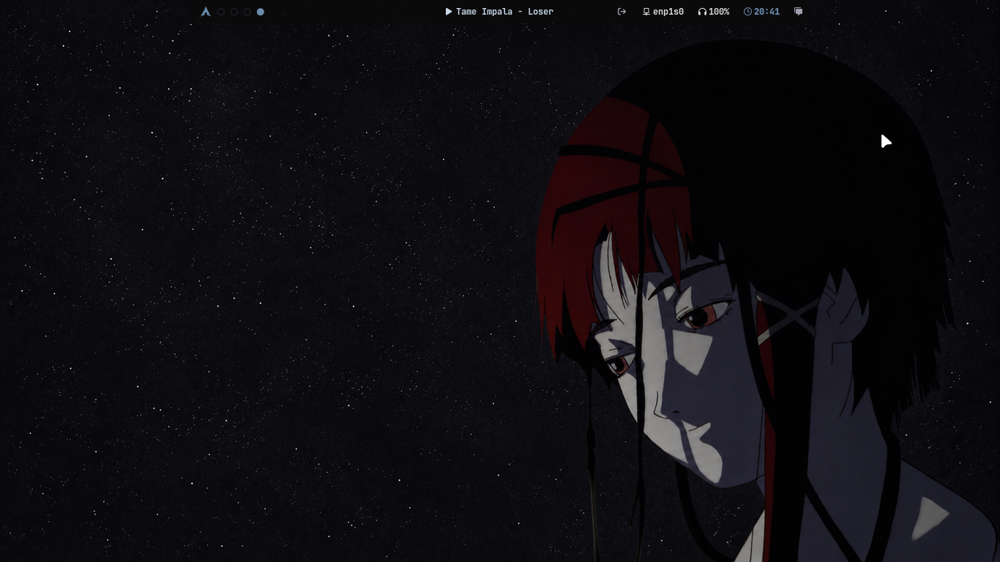
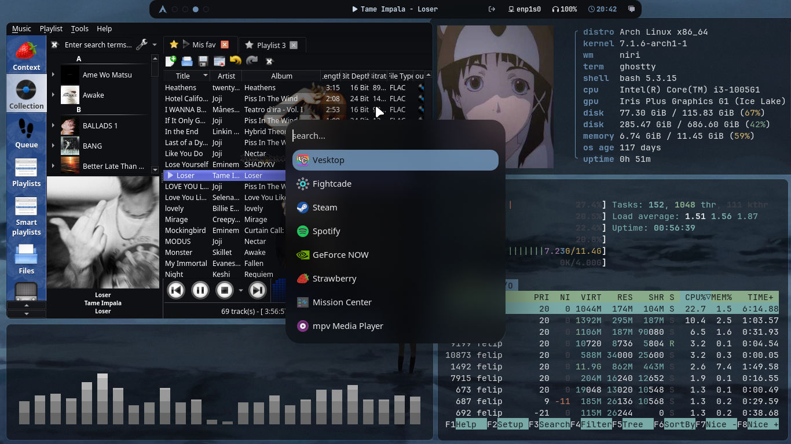
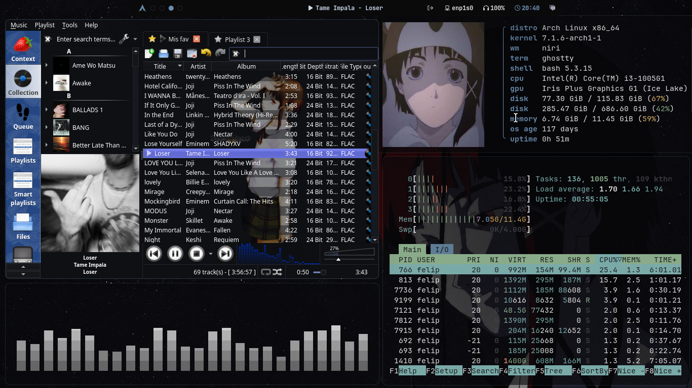
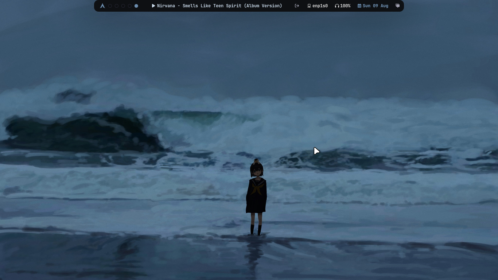
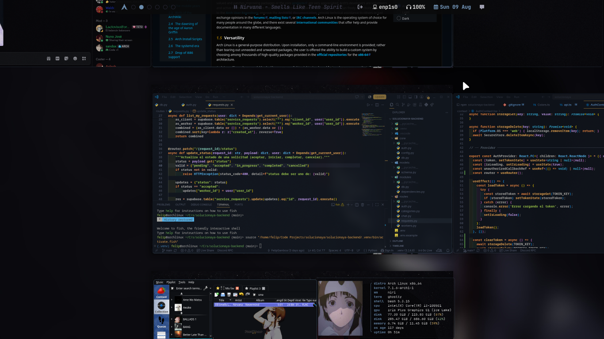

<div align="center">

# niri-dots

My personal desktop configuration for [**niri**](https://github.com/YaLTeR/niri) on Arch Linux — a scrolling-tiling Wayland compositor.



</div>

## Overview

This is a daily-driver setup built around niri, migrated from Hyprland. It leans into a dark, muted color palette (slate blue, terracotta, sage green) with a glassmorphism-style transparency/blur effect on select apps, a custom-shaped Waybar, and a fully custom fastfetch layout.

Hardware: Dell Inspiron 13, Intel i3-1005G1 / Iris Plus, 1366x768.

## Stack

| Component        | Tool                                    |
|-------------------|------------------------------------------|
| Compositor         | [niri](https://github.com/YaLTeR/niri) |
| Bar                | [Waybar](https://github.com/Alexays/Waybar) |
| Terminal           | [Ghostty](https://ghostty.org/) |
| App launcher       | [Rofi](https://github.com/davatorium/rofi) |
| Notifications      | [SwayNC](https://github.com/ErikReider/SwayNotificationCenter) |
| System info        | [fastfetch](https://github.com/fastfetch-cli/fastfetch) |
| File manager       | Thunar |
| Wallpaper daemon    | [awww](https://github.com/Toqozz/swww) (swww fork) via [waypaper](https://github.com/anufrievroman/waypaper) |
| Shell               | bash + [Starship](https://starship.rs/) |
| Fonts               | JetBrainsMono Nerd Font + Lexend |
| GTK theme           | adw-gtk3 (custom accent colors) |

## Highlights

- **Glassmorphism window effects** — background blur + transparency + a soft colored glow (via niri's `background-effect` and `shadow` window rules) on Thunar, VS Code, and Discord/Vesktop.
- **Custom-shaped Waybar** — a compact, centered pill bar (not full-width) with dot-style workspace indicators instead of numbers, and a matching drop-in entrance animation.
- **fastfetch with random logo rotation** — a bash function swaps the ASCII/image logo on every call from a pool of images, instead of a static distro logo.
- **Dual compositor support** — the same Waybar config works under both niri and Hyprland (each workspace/window module targets its own IPC socket and silently no-ops if that compositor isn't running).
- **Boot chain theming** — custom background on the [Visor](https://github.com/facundoolano/visor) boot menu, and a themed SDDM greeter (`silent` theme).
- **Touchpad toggle** — a keybind that live-edits niri's config to enable/disable the touchpad on the fly (useful for fighting games played on the keyboard), with a SwayNC notification confirming the new state.

## Screenshots

<table>
<tr>
<td width="50%">



</td>
<td width="50%">



</td>
</tr>
</table>





## Repository structure

```text
config/       -> goes in ~/.config/
local/bin/    -> goes in ~/.local/bin/ (custom scripts, e.g. touchpad-toggle.sh)
bashrc        -> my ~/.bashrc (real shell is bash, not fish)
```

## Installation

```bash
git clone https://github.com/Sandox0/niri-dots.git
cd niri-dots

cp -r config/* ~/.config/
cp -r local/bin/* ~/.local/bin/
cp bashrc ~/.bashrc
```

> [!WARNING]
> Some configs reference absolute paths (`/home/felip/...`). Search and replace with your own username/home directory before using these as-is.

## Acknowledgements

- Base dotfiles structure forked from [deridray/dotfiles](https://github.com/deridray/dotfiles).
- Window-open shader animation and rounded-corner window rules adapted from hakuspace's niri/Hyprland/mango dots.

## License

GPL-3.0 — see [LICENSE](LICENSE).
